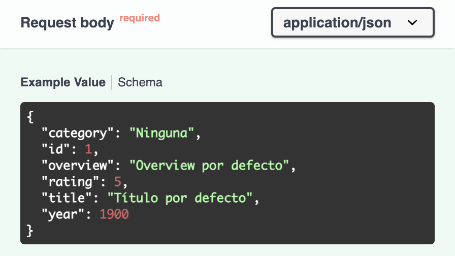
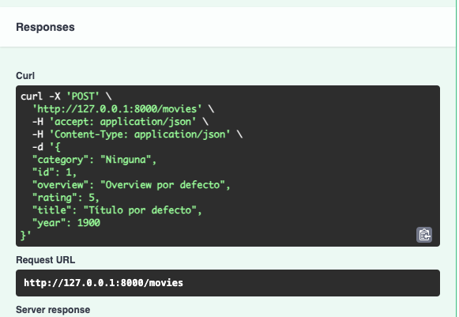

# Notes ⚡

- [Intro](#intro)
  - [Instalación y configuración](#instalación-y-configuración)
  - [Primera app](#primera-app)
  - [Documentación](#documentación)
- [CRUD y Path Operations](#crud-y-path-operations)
  - [GET y parámetros](#get-y-parámetros)
  - [POST](#post)
  - [PUT](#put)
  - [DELETE](#delete)
- [Validación de datos](#validación-de-datos)
  - [Modelo de datos o esquema](#modelo-de-datos-o-esquema)
  - [Validaciones de datos](#validaciones-de-datos)
  - [Validaciones de parámetros](#validaciones-de-parámetros)
- [Tipos de respuestas y códigos de estados](#tipos-de-respuestas-y-códigos-de-estados)
  - [Tipos de respuestas](#tipos-de-respuestas)
  - [Códigos de estado](#códigos-de-estado)
- [Modularización](#modularización)
- [Middlewares](#middlewares)
- [Dependencias](#dependencias)
- [Manejo de errores](#manejo-de-errores)

## Intro

-   **FastAPI**: Framework moderno, rápido (de alto rendimiento) para construir APIs con Python 3.7+ basado en las anotaciones de tipos (_type hints_) de Python.
-   **Características**:
    -   **Basado en estándares**: OpenAPI (documentación), OAuth2 (integrado)...
    -   **Rápido**: Utiliza herramientas existentes, ya rápidas.
    -   **Contiene menos errores**, en parte gracias a las anotaciones de tipo.
    -   **Fácil e intuitivo**, en parte gracias a cómo es Python y a su documentación.
    -   **Robusto**.
-   Creado por Sebastián Ramírez 🇨🇴 en 2018.
-   Marco utilizado por FastAPI:
    -   **Starlette**: framework para desarrollo web, muy rápido. FastAPI se basa mucho en él.
    -   **Pydantic**. Encargado de los datos.
    -   **Uvicorn**. Ejecuta la aplicación.

### Instalación y configuración

-   Visual Studio Code (...)
-   Creación de entorno virtual: `python3.11 -m venv venv` (o `python3 -m venv venv`)
-   Activación del entorno: `source venv/bin/activate`
-   Instalamos fastapi y uvicorn: `pip install fastapi uvicorn`

Seleccionamos el intérprete de Python de VSC. Debe ser la misma que la del entorno que hemos instalado.

### Primera app

-   Creamos `main.py`
-   Importamos FastAPI
-   Inicializamos la app
-   Creamos la primera ruta, a /.
-   Función "home" para esta ruta que devuelva "Hola, mundo"
-   Ejecutamos con `uvicorn main:app`. Nos devuelve una URL donde podemos ver la aplicación.
    -   Si quieremos cambiar el puerto por defecto, ejecutaríamos `uvicorn main:app --port 5000`, por ejemplo.
    -   Para que el servidor se recargue automáticamente incluiremos `--reload`.
    -   Si queremos que la app se pueda ver desde toda la red local, usaremos `--host` con la ip `0.0.0.0`.
    -   `uvicorn main:app --host 0.0.0.0 --port 5000 --reload`

```py
from fastapi import FastAPI

app = FastAPI()

@app.get('/')
def home():
    return "Hola, mundo!"
```

### Documentación

-   Se genera de manera automática, que describe cada uno de los _endpoints_, entre otras muchas cosas.
-   Podemos acceder a ella desde la url y `/docs`.
-   La documentación se puede modificar:
    -   Título, con `app.title`
    -   Versión, con `app.version`
    -   Tags. Podemos decir, por ejemplo, que el endpoint / pertenece a 'Home'. Si creamos otro endpoint con el mismo tag, la documentación de FastAPI los agrupará en el mismo epígrafe. 
-   Si entramos en un endpoint, podemos ejecutarlo para ver cómo funciona directamente desde la documentación.

```py
from fastapi import FastAPI

app = FastAPI()

app.title = "Mi primera app con FastAPI"
app.version = "2.0.0"

@app.get('/', tags=['Home'])
def home():
    return "Hola, mundo!"

@app.get('/home', tags=['Home'])
def home():
    return "Hola, mundo!"
```

-   Hay otro tipo de documentación integrada: **redoc**. Se accede a través de `/redoc`.
-   Funciona de manera semejante.

## CRUD y Path Operations

-   **CRUD**:
    -   Create: `POST`
    -   Read: `GET`
    -   Update: `PUT`
    -   Delete: `REMOVE`

### GET y parámetros

#### GET

-   Con GET el cliente verá lo que devolvemos con el `return`, sea un _string_, un diccionario u otro tipo de dato.
    -   Un tipo de dato posible es HTML. Para ello, debemos importar este tipo de respuesta: `from fastapi.responses import HTMLResponse`.
    -   Después lo devolveríamos como `return HTMLResponse('<h1>Hello, world</h1>')`
-   Creamos una lista con diccionarios, uno por película.

```py
from fastapi import FastAPI
from fastapi.responses import HTMLResponse

app = FastAPI()

movies = [
    {"id": 1,
    "title": "Avatar",
    "overview": "Bastante sobrevalorada",
    "year": "2009",
    "rating": 6.2,
    "category": "Acción"}
]

@app.get('/', tags=['Home'])
def home():
    return "Hola, mundo!"

@app.get('/movies', tags=['Movies'])
def get_movies():
    return movies
```

#### Parámetros de ruta

-   Podemos usar **parámetros de rutas** desde una URL, lo hacemos con `{id}` en la ruta.
-   En la función, indicaremos que debemos recibir por parámetro una variable (id) de tipo int. `get_movie(id: int)`. De este modo, ya podremos acceder al parámetro.
-   En la función `get_movie` podemos recorrer las películas con `for` y, si el id de alguna coincide con el parámetro, le indicamos que devuelva esa película y, si no, una lista vacía.

```py
@app.get('/movies/{id}', tags=['Home'])
def get_movie(id: int):
    for movie in movies:
        if movie['id'] == id:
            return movie
    return []
```

#### Parámetros Query

-   En los parámetros de ruta usábamos la dirección, con la ruta y un parámetro específico, por ejemplo `http://localhost:5000/movies/1`. Los parámetros Query tienen otra estructura:
    -   Aquí, además del valor, debe ir su clave, es decir, el nombre del parámetro, `id=1`.
    -   Además, van precedidos del símbolo de interrogación `?`.
    -   `http://localhost:5000/movies/?id=1`
-   Son muy fáciles de definir, simplemente tenemos que hacerlo en la función y no en la URL.

    -   Si queremos usar una _query_ por categorías, su función podría ser `def get_movie_by_category(category: str)`. Es decir, definiendo aí la categoría y no en la ruta.

        ```py
        @app.get('/movies/', tags=['Movies'])
        def get_movie_by_category(category: str):
            return category
        ```

        -   Por que `/movies/`, con la barra final? Porque ya teníamos definida la ruta `/movies` y porque en este caso tendrá algo a continuación de la barra: los parámetros query.

    

-   Y si queremos añadir un segundo parámetro? Lo hacemos después del anterior, separados por una coma: `def get_movie_by_category(category: str, year: int)`.
-   En la documentación, al probar esta ruta, podremos ver la URL completa: `http://127.0.0.1:8000/movies/?category=Comedia&year=2001`.
-   Podemos actualizar la función:

    ```py
    @app.get('/movies/', tags=['Movies'])
    def get_movie_by_category(category: str, year: int):
        for movie in movies:
            if movie['category'] == category:
                return movie
        return []
    ```

    

### POST

-   Usado para crear registros.
-   Podemos usar rutas idénticas definidas con GET, ya que se acceden por un método distinto.
-   Definimos los parámetros de las películas (en este caso) que vamos a crear y los igualamos a una nueva película que añadiremos a la lista en la función.

    

    ```py
    @app.post('/movies', tags=['Movies'])
    def create_movie(id: int, title: str, overview: str, year: int, rating: float, category: str):
        movies.append({
            'id': id,
            'title': title,
            'overview': overview,
            'year': year,
            'rating': rating,
            'category': category
        })
    ```

-   Como vemos en la imagen, la documentación ya detecta que los parámetros son de tipo query.
-   A pesar de que podría funcionar, no parece que pasar estos datos por URL sea lo más conveniente. Sería mejor enviarlos a través del cuerpo de la petición (**_Request Body_**). Para ello debemos importar la clase `Body`: `from fastapi import Body`. En nuestro caso ya importábamos `FastApi` desde `fastapi`, así que el _import_ completo será `from fastapi import FastAPI, Body`.
-   Ahora debemos indicar que los parámetros query van a ser recibimos como parte del cuerpo de la petición. Lo hacemos igualando los parámetros de la función a `Body()`.

    

    ```py
    def create_movie(
        id: int = Body(),
        title: str = Body(),
        overview: str = Body(),
        year: int = Body(),
        rating: float = Body(),
        category: str = Body()
        ):
    ```

-   Comprobamos que ahora ya no se exigen unos parámetros, sino un cuerpo.

```py
@app.post('/movies', tags=['Movies'])
def create_movie(
    id: int = Body(),
    title: str = Body(),
    overview: str = Body(),
    year: int = Body(),
    rating: float = Body(),
    category: str = Body()
    ):
    movies.append({
        'id': id,
        'title': title,
        'overview': overview,
        'year': year,
        'rating': rating,
        'category': category
    })
    return movies
```

### PUT

-   Sirve para modificar datos.
-   De nuevo, puede usar rutas existentes, ya que se accederá a ellas a través de un método diferente.
-   Introducimos los parámetros que se modificarán, tal y como hicimos en `POST`.
-   Luego recorreremos las películas hasta dar con aquella con el mismo id que el pasado por Request Body.
-   Una vez se encuentre, igualaremos los campos a los introducimos.
-   Finalmente, devolvemos la lista actualizada.

    ```py
    @app.put('/movies/{id}', tags=['Movies'])
    def update_movie(
        id: int
        title: str = Body(),
        overview: str = Body(),
        year: int = Body(),
        rating: float = Body(),
        category: str = Body()
        ):
        for movie in movies:
            if movie['id'] == id:
                movie['title'] = title,
                movie['overview'] = overview,
                movie['year'] = year,
                movie['rating'] = rating,
                movie['category'] = category
        return movies
    ```

    

### DELETE

-   Semejante al anterior.
-   Aquí no pasaremos valores, sólo eliminaremos la película.
-   Pasamos el id, recorremos las películas y, cuando encontremos la coincidence, usamos remove() para quitar aquella de la lista.

    ```py
    @app.delete('/movies/{id}', tags=['Movies'])
    def get_movie(id: int):
        for movie in movies:
            if movie['id'] == id:
                movies.remove(movie)
        return movies
    ```

    

## Validación de datos

### Modelo de datos o esquema

-   Una de las principales características de FastAPI es la creación de esquemas o modelos.
-   Para ello, usa una librería integrada, que ya ha sido mencionada, llamada Pydantic.
-   Para entender la utilidad de esto, volvamos a nuestro método POST. Imaginemos en lugar de estes parámetros, tenemos un número mucho más alto. ¿Tendremos que escribir el equivalente de `title: str = Body()` tantas veces y repetirlo después en PUT? No, para ello tenemos los modelos de Pydantic.
-   Comenzamos creando una clase, que herederá de otra que debemos importar, BaseModel. `from pydantic import BaseModel`
-   Creamos la clase (con la primera letra en mayúsculas) y añadimos los atributos, ya que Pydantic se ayuda mucho de las anotaciones de tipo.

    ```py
    class Movie(BaseModel):
    id: int
    title: str
    overview: str
    year: int
    rating: float
    category: str
    ```

-   Ahora usaremos la clase en el POST anterior. Substituímos el listado de parámetros solamente por `movie` indicando su tipo `Movie`, el del esquema creado.
-   Ahora, en lugar de hacer el `append` con todos aquellos valores, indicamos solamente `movie`, pero convirtiéndolo a diccionario, ya que es lo requerido por `append()`. Esto lo hacemos con `model_dump()`.

    ```py
    @app.post('/movies', tags=['Movies'])
    def create_movie(movie: Movie):
        movies.append(movie.model_dump())
        return movies
    ```

-   Ahora al final de la documentación, en Schemas, además de los esquemas creados por defecto, también podremos ver el nuestro. 
-   Ahora podríamos hacer lo mismo en PUT, pero aquí, a diferencia de POST, no es necesario el id.
    -   Una opción sería decir que el tipo de id puede inst o None, y que por defecto sea None. `id: int | None = None`
    -   Otra opción, más recomendable, sería usar Optional. Para ello lo importamos de `typing`: `from typing import Optional`.
        -   Con esto ya podremos reemplazar el tipo de dato por `Optional` y que, si existe, sea entero: `id: Optional[int] = None`
-   Ahora ya podemos actualizar PUT.

    -   Primero indicamos que vamos a recibir un id y movie. `def update_movie(id: int, movie: Movie):`
    -   Substituímos `title`, `overview` y más campos por `movie.title`, `movie.overview`, etc.
    -   Ya que ahora estamos usando `movie` y este es el nombre que también usamos para cada película cuando recorremos el bucle, cambiamos el nombre de este caso a item.

        ```py
        @app.put('/movies/{id}', tags=['Movies'])
        def update_movie(id: int, movie: Movie):
            for item in movies:
                if item['id'] == id:
                    item['title'] = movie.title,
                    item['overview'] = movie.overview,
                    item['year'] = movie.year,
                    item['rating'] = movie.rating,
                    item['category'] = movie.category
            return movies
        ```

-   Al probar esto en los docs, borraremos el id en el Request Body, ya que ya no es necesario.

-   En realidad, si lo pensamos, hacer que `id` sea siempre opcional no parece una gran idea. Es mejor tener un esquema donde sí lo sea, para actualizar, y otro donde no lo sea para crear y consultar.

    -   Para ello, renombramos la clase que hemos creado a `MovieUpdate`, quitando directamente el id, y recuperamos la clase Movie tal y como la teníamos antes.
    -   En PUT cambiamos el tipo `Movie` por `MovieUpdate`.
    -   También podemos borrar el `import` de `Optional`, ya que ya no lo usamos.

        ```py
        class Movie(BaseModel):
            id: int
            title: str
            overview: str
            year: int
            rating: float
            category: str

        class MovieUpdate(BaseModel):
            title: str
            overview: str
            year: int
            rating: float
            category: str

        ```

-   También podemos usar nuestros esquemas cuando indicamos qué va a _retornar_ la función.
-   En `get_movies()`, por ejemplo, decimos que se va a devolver la lista `movies`, pero el `return` podría estar en la cabecera de la función, indicando que se va a devolver una lista del tipo `Movie`: `def get_movies() -> list[Movie]`.
-   También podríamos usar `List` en lugar de `list`, y para ello importamos `List` de `typing`: `from typing import List`.
    -   `def get_movies() -> List[Movie]`
-   En `get_movie` podemos usar esto también, pero aquí sólo se devuelve un filme, no una lista, por tanto: `def get_movie(id: int) -> Movie:`. Igual en `def get_movie_by_category(category: str, year: int) -> Movie`.
-   También `def create_movie(movie: Movie) -> List[Movie]` y otros.

### Validaciones de datos

-   FastAPI, gracias a Pydantic, realiza algunas validaciones por defecto, sin que nosotros tengamos que hacer nada.
    -   Una de ellas es comprobar que se envían todos los campos necesarios. Hasta ahora, si queríamos crear una nueva película, pero nos faltaba un campo como el título, veíamos un error `Field required`.
    -   La otra validación que realiza FastAPI es la que viene determinada por los tipos. Si indicamos que algo debe ser un `int`, pero le pasamos como valor una cadena de texto se producirá un error. `Input should be a valid integer...`
-   Para conocer qué otras validaciones podemos hacer con FastAPI, crearemos un nuevo modelo de datos `MovieCreate` e importaremos la clase `Field` de Pydantic.
-   Igualamos los campos a Field y, como argumentos de este, podemos pasar algunas validaciones como:
    -   `min_length` o `max_length`
    -   `gt` (_greater than_), `ge` (_greater than or equal_), `lt` (_less than_) o `le` (_less than or equal_)
    -   `default` para valores por defecto.
-   Podemos decir que un año sea menor o igual que el actual. Para ello importamos `datetime`. En el campo usaremos `Field(le=datetime.date.today().year)`.
-   En `createmovie()` reemplazamos a `Movie` por el esquema `MovieCreate`. `def create_movie(movie: MovieCreate) -> List[Movie]:`. Probamos en la documentación y todo debería funcionar.

    ```py
    class MovieCreate(BaseModel):
        id: int
        title: str = Field(min_length=5, max_length=30, default="My movie")
        overview: str = Field(min_length=15, max_length=100, default="Esta película trata...")
        year: int = Field(le=datetime.date.today().year, gt=1880)
        rating: float = Field(ge=0, le=10, default=5)
        category: str = Field(min_length=5, max_length=50)
    ```

-   Otra forma de dar valores por defecto es **extendiendo la configuración**. Para ello quitamos los introducidos anteriormente. Y escribimos el atributo `model_config` dentro de `MovieCreate`. Este pertenece a `BaseModel`. Dentro de `model_config` creamos una serie de campos y, finalmente, los valores por defecto.

    ```py
    class MovieCreate(BaseModel):
    id: int
    title: str = Field(min_length=5, max_length=30)
    overview: str = Field(min_length=15, max_length=100)
    year: int = Field(le=datetime.date.today().year, gt=1880)
    rating: float = Field(ge=0, le=10)
    category: str = Field(min_length=5, max_length=50)

    model_config = {
        'json_schema_extra': {
            'example': {
                'id': 1
                'title': "Título por defecto"
                'overview': "Overview por defecto"
                'year': 1900
                'rating': 5.0
                'category': "Ninguna"
            }
        }
    }
    ```

-   En la documentación ya podemos ver los valores por defecto. Están desordenados, pero eso no es un problema.
    

---

Bola extra!

-   Vamos a **mejorar la legibilidad de nuestro código** de cara a la documentación. Ahora mismo estamos enviando como respuesta una lista de diccionarios (`movies=[{}, {}]`) y no una lista de objectos película.
-   Para ello, vamos indicar que `movies` es en realidad una lista de tipo `Movie`: `movies: List[Movie] = []`.
-   Cuando creamos una película, ya no la registramos como un diccionario (`movies.append(movie.model_dump())`), sino solamente el objecto (movies.append(movie)).
-   Al devolverla dará un error, ya ahora mismo `movies` devuelve una lista de objetos de tipo `Movie`. Por tanto, al retornar, sí deberíamos convertilas a diccionario. Por cada película, la convertiremos en diccionario. `return [movie.model_dump() for movie in movies]`. Haremos esto en todos los que previamente devolvían varias películas.
-   Donde solamente devolvíamos una película, ahora la convertimos en diccionario. `return movie.model_dump()`

---

### Validaciones de parámetros

#### De ruta

-   Comenzamos importando `Path` de `fastapi`.
-   Nos dirigimos a aquellas rutas donde usemos parámetros de ruta, como en `/movies/{id}`.

    -   En `def get_movie(id: int)` indicamos que ese id debe ser mayor que 0 del siguiente modo `def get_movie(id: int = Path(gt=0))`. De este modo, cuando se ingrese un 0 este será mayor a 0.
    -   Para mejorar el código en esta función debemos hacer otra serie de cambios:

        -   Si ingresamos 0 como id y no se encuentra una película válida, el código actual devolvería una lista , pero debemos devolver un objeto vacío e indicar ese tipo. De este modo, debemos indicar que devuelva una Movie o un `dict` si no encuentra nada.
        -   Como ya no trabajamos con diccionarios (sólo lo hacemos para responder los datos), debemos cambiar el modo de comprobar el id, así, en lugar de `if movie['id'] == id` deberemos tener

        ```py
        @app.get('/movies/{id}', tags=['Movies'])
        def get_movie(id: int = Path(gt=0)) -> Movie | dict:
            for movie in movies:
                if movie.id == id:
                    return movie.model_dump()
            return {}
        ```

#### Query

-   Importamos `Query` de `fastapi`
-   Vamos a una ruta que use parámetros query, como la correspondiente a la función `get_movie_by_category`.
-   Para este caso vamos a obviar el año y quedarnos sólo con la categoría. Diremos que es igual a Query, y que tendrá entre 5 y 20 caracteres.
-   Como antes, indicaremos que puede devolver también un diccionario, en caso de que la búsqueda no encuentre resultados.

    ```py
    @app.get('/movies/', tags=['Movies'])
    def get_movie_by_category(category: str = Query(min_length=5, max_length=20)) -> Movie | dict:
        for movie in movies:
            if movie.category == category:
                return movie.model_dump()
        return {}
    ```

## Tipos de respuestas y códigos de estados

### Tipos de respuestas

-   Cuando enviamos una petición podemos obtener distintos tipos de respuestas. Ahora mismo, cuando hacemos `get_movies` se nos devuelve un **JSON**, sin embargo, podemos usar una clase llamada `JSONResponse`. La usemos o no, en nuestro caso la respuesta será igualmente un JSON. No obstante, esto puede ayudarnso a mejorar la documentación del código. La uresamos en varias rutas.

    ```py
    def get_movies() -> List[Movie]:
        content = [movie.model_dump() for movie in movies]
        return JSONResponse(content=content)
    ```

    ```py
        def get_movie_by_category(category: str = Query(min_length=5, max_length=20)) -> Movie | dict:
        for movie in movies:
            if movie.category == category:
                return JSONResponse(content = movie.model_dump())
        return JSONResponse(content ={})
    ```

-   Otro tipo de respuesta es a través de **texto plano**. Para ello importamos `PlainTextResponse`. Esto nos devolverá un texto plano sin formato.
-   Podemos probarlo así:

    ```py
    @app.get('/', tags=['Home'])
    def home():
        return PlainTextResponse(content='Home')
    ```

-   Otro tipo de respuesta es el de **redirección**, importando `RedirectResponse`. La probaremos al crear películas, redirigiendo al inicio. Debemos indicar un código de estado, para que se entienda que se trata de una redirección en la misma aplicación.

    ```py
    @app.post('/movies', tags=['Movies'])
    def create_movie(movie: MovieCreate) -> List[Movie]:
        movies.append(movie)
        content = [movie.model_dump() for movie in movies]
        # return JSONResponse(content=content)
        return RedirectResponse('/movies', status_code=303)
    ```

    

-   Finalmente, otro tipo de respuesta es como **archivo**, para ello importaremos la clase `FileResponse`. Ahora creamos una ruta específica en la que indicaremos donde se encuentra algún archivo que tengamos en nuestro programa. Lo probaremos dirigiéndonos a la ruta correspondiente.

    ```py
    @app.get('/get_file')
    def get_file():
        return FileResponse('archivo_prueba.txt')
    ```

### Códigos de estado

-   Son aquellos códigos que aparecen cuando recibimos una respuesta, como por ejemplo `200` cuando ésta es positiva.
-   Los modificamos en la respuesta que devuelve cada función, con `status_code=` y el número que deseamos mostrar cuando los datos se devuelvan correctamente. Por ejemplo:

    ```py
    @app.get('/movies', tags=['Movies'])
    def get_movies() -> List[Movie]:
        content = [movie.model_dump() for movie in movies]
        return JSONResponse(content=content, status_code=200)
    ```

-   Podemos añadir el código `404` para quando no se encuentre lo que se busca, `201` para las creaciones de películas o `303` para redirección.
-   Para efectos de documentación, el otro lugar donde podemos definir este código es entre los argumentos de la definición. En este ejemplo, por defecto se esperaría obtener el código 500.

    ```py
    @app.get('/movies', tags=['Movies'], status_code=500)
    ```

-   La descripción de la respuesta también se puede cambiar en el mismo lugar.

    ```py
    @app.get('/movies', tags=['Movies'], status_code=500, response_description="Nos debe devolver una respuesta exitosa")
    ```

#### Errores personalizados

-   Ahora veremos como personalizar los mensajes de error que se generan de forma automática. Lo haremos extendiendo las validaciones de `pydantic` vistas anteriormente.
-   Comenzamos importando la clase `validator` de Pydantic.
-   Nos dirigimos a la clase `MovieCreate()`, después de `model_config` y escribimos `@validator()`, que recibirá como argumento aquello que queramos validar, en nuestro ejemplo `title`.
-   A continuación creamos una función, que recibirá como primer parámetro la clase a la que pertenece el método, y como segundo el valor que queremos validar. Como cuerpo de la función, irán las validaciones.
-   Dentro del cuerpo podemos lanzar excepciones con `ValueError` y un mensaje personalizado.
-   Ahora se pueden quitar las validaciones introducidas previamente.

    ```py
    class MovieCreate(BaseModel):
        id: int
        title: str
        overview: str = Field(min_length=15, max_length=100)
        year: int = Field(le=datetime.date.today().year, gt=1880)
        rating: float = Field(ge=0, le=10)
        category: str = Field(min_length=5, max_length=50)

        model_config = {
            'json_schema_extra': {
                'example': {
                    'id': 1,
                    'title': "Título por defecto",
                    'overview': "Overview por defecto",
                    'year': 1900,
                    'rating': 5.0,
                    'category': "Ninguna"
                }
            }
        }

        @validator('title')
        def validate_title(cls, value):
            if len(value) < 5:
                raise ValueError('El título debe tener como mínimo 5 caracteres')
            if len(value) > 30:
                raise ValueError('El título debe tener como máximo 30 caracteres')
    ```

## Modularización

- Si seguimos añadiendo más **rutas**, observaremos que nuestro archivo `main` se queda demasiado grande. Es bueno tener el organizado bien organizado para facilitar su legibilidad. Aquí es donde entran los **`router`**. 
  - Antes de pasar a los `router` vamos a organizar un poco el código:
    - Creamos la carpeta `src` y movemos allí nuestro archivo `main`.
    - Esto implica que cuando ejecutemos `uvicorn` tengamos que llamarlo `src.main:app`
    - Creamos la carpeta `routers` con un archivo `__init__.py` en su interior, para que sepa que esta carpeta es un módulo y que se pueda acceder facilmente a los archivos de la carpeta.
    - Creamos también `movie_router.py` dentro de `routers`.
  - Ahora quitamos de `main` todas las rutas que tengan que ver con películas (todas) y las pasamos a `movie_routers.py`.
    - Esto generará que aparezcan muchos errores. VSC nos va a permitir solucionar la mayoría fácilmente.
  - Copiamos también la lista de películas.
- También será conveniente moder los **modelos**. 
  - Creamos una nueva carpeta en `src`, llamada `models`.
  - Agregamos `__init__.py` y `movie_model.py`.
  - En `movie_model.py` ponemos las clases que teníamos e importamos las librerías necesarias.
  - Hecho esto, deberemos llamar los modelos desde `movie_router.py`. Lo haremos con `from src.models.movie_model import *`
- Antes de pasar al `main` debimos seguir trabajando con los *routers*.
  - Primero importamos `APIRouter` desde `fastapi` **en `movie_router.py`** y definimos `movie_router=APIRouter()`. Este router solo va a contener las rutas de las películas.
  - En `movie_router` cambiamos `@app` por `@movie_router`
- Pasamos a `main`:
  - Importamos los routers: `from src.routers.movie_router import movie_router`
  - Para añadir las rutas indicamos que `app.include_router(router=movie_router)`
  - En la documentación se respetará el orden en que definimos las rutas. Por lo que si ejecutamos `app.include_router()` antes que la ruta de Home, Home aparecerá al final.
- Si accedemos a nuestra documentación, todo debería estar como antes. En cambio, ahora podemos realizar una pequeña mejora:
  - Todas las rutas de Movies empiezan por `/movies`. Podemos evitar esta redundancia añadiendo un prefijo:

    ```py
    app.include_router(prefix='/movies', router=movie_router)
    ```

    - En las rutas substituímos `/movies` por `/`
    - Esto ahora hace que algunas rutas sean idénticas a otras, como la de obtener las películas filtradas por categoría. Para solucionar esto, cambiamos la ruta a `/by_category`.

## Middlewares

## Dependencias


## Manejo de errores
