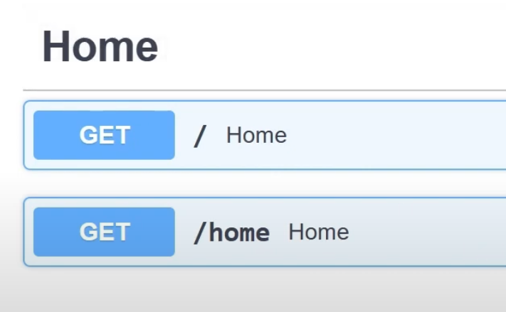
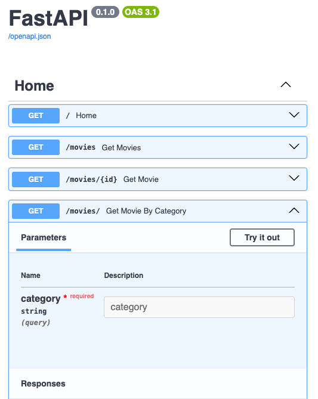
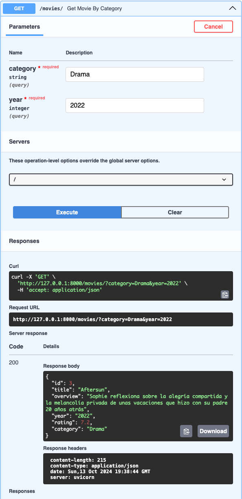
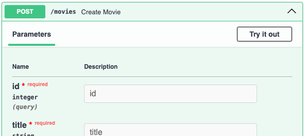
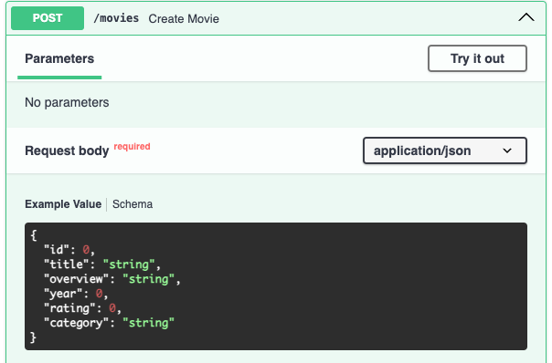
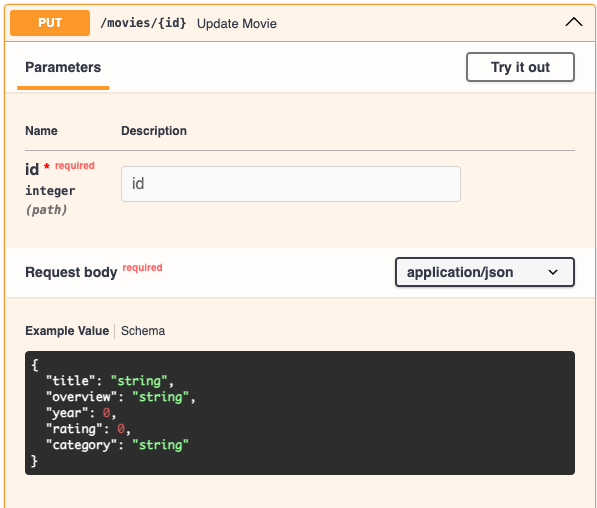
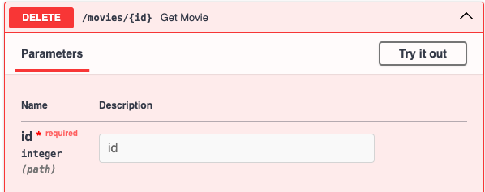
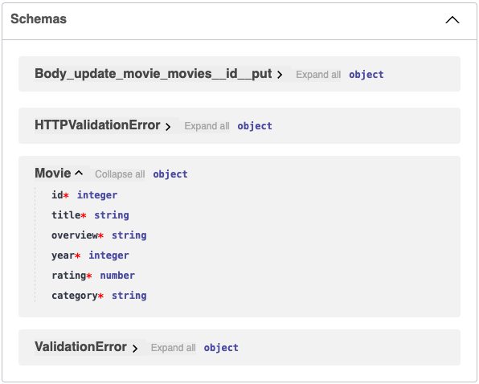

# Notes

- [Intro](#intro)
  - [Instalación y configuración](#instalación-y-configuración)
  - [Primera app](#primera-app)
  - [Documentación](#documentación)
- [CRUD y Path Operations](#crud-y-path-operations)
  - [GET y parámetros](#get-y-parámetros)
  - [POST](#post)
  - [PUT](#put)
  - [DELETE](#delete)
- [Validación de datos](#validación-de-datos)
  - [Modelo de datos o esquema](#modelo-de-datos-o-esquema)
  - [Validaciones de datos](#validaciones-de-datos)
  - [Validaciones de parámetros](#validaciones-de-parámetros)
- [Tipos de respuestas y códigos de estados](#tipos-de-respuestas-y-códigos-de-estados)
- [Middlewares](#middlewares)
- [Dependencias](#dependencias)
- [Modularización](#modularización)
- [Manejo de errores](#manejo-de-errores)

## Intro

-   **FastAPI**: Framework moderno, rápido (de alto rendimiento) para construir APIs con Python 3.7+ basado en las anotaciones de tipos (_type hints_) de Python.
-   **Características**:
    -   **Basado en estándares**: OpenAPI (documentación), OAuth2 (integrado)...
    -   **Rápido**: Utiliza herramientas existentes, ya rápidas.
    -   **Contiene menos errores**, en parte gracias a las anotaciones de tipo.
    -   **Fácil e intuitivo**, en parte gracias a cómo es Python y a su documentación.
    -   **Robusto**.
-   Creado por Sebastián Ramírez 🇨🇴 en 2018.
-   Marco utilizado por FastAPI:
    -   **Starlette**: framework para desarrollo web, muy rápido. FastAPI se basa mucho en él.
    -   **Pydantic**. Encargado de los datos.
    -   **Uvicorn**. Ejecuta la aplicación.

### Instalación y configuración

-   Visual Studio Code (...)
-   Creación de entorno virtual: `python3.11 -m venv venv` (o `python3 -m venv venv`)
-   Activación del entorno: `source venv/bin/activate`
-   Instalamos fastapi y uvicorn: `pip install fastapi uvicorn`

Seleccionamos el intérprete de Python de VSC. Debe ser la misma que la del entorno que hemos instalado.

### Primera app

-   Creamos `main.py`
-   Importamos FastAPI
-   Inicializamos la app
-   Creamos la primera ruta, a /.
-   Función "home" para esta ruta que devuelva "Hola, mundo"
-   Ejecutamos con `uvicorn main:app`. Nos devuelve una URL donde podemos ver la aplicación.
    -   Si quieremos cambiar el puerto por defecto, ejecutaríamos `uvicorn main:app --port 5000`, por ejemplo.
    -   Para que el servidor se recargue automáticamente incluiremos `--reload`.
    -   Si queremos que la app se pueda ver desde toda la red local, usaremos `--host` con la ip `0.0.0.0`.
    -   `uvicorn main:app --host 0.0.0.0 --port 5000 --reload`

```py
from fastapi import FastAPI

app = FastAPI()

@app.get('/')
def home():
    return "Hola, mundo!"
```

### Documentación

-   Se genera de manera automática, que describe cada uno de los _endpoints_, entre otras muchas cosas.
-   Podemos acceder a ella desde la url y `/docs`.
-   La documentación se puede modificar:
    -   Título, con `app.title`
    -   Versión, con `app.version`
    -   Tags. Podemos decir, por ejemplo, que el endpoint / pertenece a 'Home'. Si creamos otro endpoint con el mismo tag, la documentación de FastAPI los agrupará en el mismo epígrafe. 
-   Si entramos en un endpoint, podemos ejecutarlo para ver cómo funciona directamente desde la documentación.

```py
from fastapi import FastAPI

app = FastAPI()

app.title = "Mi primera app con FastAPI"
app.version = "2.0.0"

@app.get('/', tags=['Home'])
def home():
    return "Hola, mundo!"

@app.get('/home', tags=['Home'])
def home():
    return "Hola, mundo!"
```

-   Hay otro tipo de documentación integrada: **redoc**. Se accede a través de `/redoc`.
-   Funciona de manera semejante.

## CRUD y Path Operations

-   **CRUD**:
    -   Create: `POST`
    -   Read: `GET`
    -   Update: `PUT`
    -   Delete: `REMOVE`

### GET y parámetros

#### GET

-   Con GET el cliente verá lo que devolvemos con el `return`, sea un _string_, un diccionario u otro tipo de dato.
    -   Un tipo de dato posible es HTML. Para ello, debemos importar este tipo de respuesta: `from fastapi.responses import HTMLResponse`.
    -   Después lo devolveríamos como `return HTMLResponse('<h1>Hello, world</h1>')`
-   Creamos una lista con diccionarios, uno por película.

```py
from fastapi import FastAPI
from fastapi.responses import HTMLResponse

app = FastAPI()

movies = [
    {"id": 1,
    "title": "Avatar",
    "overview": "Bastante sobrevalorada",
    "year": "2009",
    "rating": 6.2,
    "category": "Acción"}
]

@app.get('/', tags=['Home'])
def home():
    return "Hola, mundo!"

@app.get('/movies', tags=['Movies'])
def get_movies():
    return movies
```

#### Parámetros de ruta

-   Podemos usar **parámetros de rutas** desde una URL, lo hacemos con `{id}` en la ruta.
-   En la función, indicaremos que debemos recibir por parámetro una variable (id) de tipo int. `get_movie(id: int)`. De este modo, ya podremos acceder al parámetro.
-   En la función `get_movie` podemos recorrer las películas con `for` y, si el id de alguna coincide con el parámetro, le indicamos que devuelva esa película y, si no, una lista vacía.

```py
@app.get('/movies/{id}', tags=['Home'])
def get_movie(id: int):
    for movie in movies:
        if movie['id'] == id:
            return movie
    return []
```

#### Parámetros Query

-   En los parámetros de ruta usábamos la dirección, con la ruta y un parámetro específico, por ejemplo `http://localhost:5000/movies/1`. Los parámetros Query tienen otra estructura:
    -   Aquí, además del valor, debe ir su clave, es decir, el nombre del parámetro, `id=1`.
    -   Además, van precedidos del símbolo de interrogación `?`.
    -   `http://localhost:5000/movies/?id=1`
-   Son muy fáciles de definir, simplemente tenemos que hacerlo en la función y no en la URL.

    -   Si queremos usar una _query_ por categorías, su función podría ser `def get_movie_by_category(category: str)`. Es decir, definiendo aí la categoría y no en la ruta.

        ```py
        @app.get('/movies/', tags=['Movies'])
        def get_movie_by_category(category: str):
            return category
        ```

        -   Por que `/movies/`, con la barra final? Porque ya teníamos definida la ruta `/movies` y porque en este caso tendrá algo a continuación de la barra: los parámetros query.



-   Y si queremos añadir un segundo parámetro? Lo hacemos después del anterior, separados por una coma: `def get_movie_by_category(category: str, year: int)`.
-   En la documentación, al probar esta ruta, podremos ver la URL completa: 'http://127.0.0.1:8000/movies/?category=Comedia&year=2001'.
-   Podemos actualiza la función:

    ```py
    @app.get('/movies/', tags=['Movies'])
    def get_movie_by_category(category: str, year: int):
        for movie in movies:
            if movie['category'] == category:
                return movie
        return []
    ```



### POST

-   Usado para crear registros.
-   Podemos usar rutas idénticas definidas con GET, ya que se acceden por un método distinto.
-   Definimos los parámetros de las películas (en este caso) que vamos a crear y los igualamos a una nueva película que añadiremos a la lista en la función. 

    ```py
    @app.post('/movies', tags=['Movies'])
    def create_movie(id: int, title: str, overview: str, year: int, rating: float, category: str):
        movies.append({
            'id': id,
            'title': title,
            'overview': overview,
            'year': year,
            'rating': rating,
            'category': category
        })
    ```

-   Como vemos en la imagen, la documentación ya detecta que los parámetros son de tipo query.
-   A pesar de que podría funcionar, no parece que pasar estos datos por URL sea lo más conveniente. Sería mejor enviarlos a través del cuerpo de la petición (**_Request Body_**). Para ello debemos importar la clase `Body`: `from fastapi import Body`. En nuestro caso ya importábamos `FastApi` desde `fastapi`, así que el _import_ completo será `from fastapi import FastAPI, Body`.
-   Ahora debemos indicar que los parámetros query van a ser recibimos como parte del cuerpo de la petición. Lo hacemos igualando los parámetros de la función a `Body()`. 

    ```py
    def create_movie(
        id: int = Body(),
        title: str = Body(),
        overview: str = Body(),
        year: int = Body(),
        rating: float = Body(),
        category: str = Body()
        ):
    ```

-   Comprobamos que ahora ya no se exigen unos parámetros, sino un cuerpo.

```py
@app.post('/movies', tags=['Movies'])
def create_movie(
    id: int = Body(),
    title: str = Body(),
    overview: str = Body(),
    year: int = Body(),
    rating: float = Body(),
    category: str = Body()
    ):
    movies.append({
        'id': id,
        'title': title,
        'overview': overview,
        'year': year,
        'rating': rating,
        'category': category
    })
    return movies
```

### PUT

-   Sirve para modificar datos.
-   De nuevo, puede usar rutas existentes, ya que se accederá a ellas a través de un método diferente.
-   Introducimos los parámetros que se modificarán, tal y como hicimos en `POST`.
-   Luego recorreremos las películas hasta dar con aquella con el mismo id que el pasado por Request Body.
-   Una vez se encuentre, igualaremos los campos a los introducimos.
-   Finalmente, devolvemos la lista actualizada.

```py
@app.put('/movies/{id}', tags=['Movies'])
def update_movie(
    id: int
    title: str = Body(),
    overview: str = Body(),
    year: int = Body(),
    rating: float = Body(),
    category: str = Body()
    ):
    for movie in movies:
        if movie['id'] == id:
            movie['title'] = title,
            movie['overview'] = overview,
            movie['year'] = year,
            movie['rating'] = rating,
            movie['category'] = category
    return movies
```



### DELETE

-   Semejante al anterior.
-   Aquí no pasaremos valores, sólo eliminaremos la película.
-   Pasamos el id, recorremos las películas y, cuando encontremos la coincidence, usamos remove() para quitar aquella de la lista.

```py
@app.delete('/movies/{id}', tags=['Movies'])
def get_movie(id: int):
    for movie in movies:
        if movie['id'] == id:
            movies.remove(movie)
    return movies
```



---

Código completo hasta aquí:

```py
from fastapi import FastAPI, Body
from fastapi.responses import HTMLResponse


app = FastAPI()

movies = [
    {
        "id": 1,
        "title": "The Substance",
        "overview": "'Tú, pero mejor en todos los sentidos'",
        "year": "2024",
        "rating": 7.2,
        "category": "Ciencia Ficción"
    },
    {
        "id": 2,
        "title": "The Fall: El sueño de Alexandria",
        "overview": "Hollywood, años veinte. Tras una desafortunada caída, un especialista en secuencias de acción es ingresado en un hospital",
        "year": "2006",
        "rating": 7.0,
        "category": "Fantástico"
    },
    {
        "id": 3,
        "title": "Aftersun",
        "overview": "Sophie reflexiona sobre la alegría compartida y la melancolía privada de unas vacaciones que hizo con su padre 20 años atrás",
        "year": "2022",
        "rating": 7.2,
        "category": "Drama"
    }
]


@app.get('/', tags=['Home'])
def home():
    return "Hola, mundo!"


@app.get('/movies', tags=['Movies'])
def get_movies():
    return movies


@app.get('/movies/{id}', tags=['Movies'])
def get_movie(id: int):
    for movie in movies:
        if movie['id'] == id:
            return movie
    return []


@app.get('/movies/', tags=['Movies'])
def get_movie_by_category(category: str, year: int):
    for movie in movies:
        if movie['category'] == category:
            return movie
    return []


@app.post('/movies', tags=['Movies'])
def create_movie(
    id: int = Body(),
    title: str = Body(),
    overview: str = Body(),
    year: int = Body(),
    rating: float = Body(),
    category: str = Body()
    ):
    movies.append({
        'id': id,
        'title': title,
        'overview': overview,
        'year': year,
        'rating': rating,
        'category': category
    })
    return movies

@app.put('/movies/{id}', tags=['Movies'])
def update_movie(
    id: int,
    title: str = Body(),
    overview: str = Body(),
    year: int = Body(),
    rating: float = Body(),
    category: str = Body()
    ):
    for movie in movies:
        if movie['id'] == id:
            movie['title'] = title,
            movie['overview'] = overview,
            movie['year'] = year,
            movie['rating'] = rating,
            movie['category'] = category
    return movies

@app.delete('/movies/{id}', tags=['Movies'])
def get_movie(id: int):
    for movie in movies:
        if movie['id'] == id:
            movies.remove(movie)
    return movies
```

---

## Validación de datos

### Modelo de datos o esquema

-   Una de las principales características de FastAPI es la creación de esquemas o modelos.
-   Para ello, usa una librería integrada, que ya ha sido mencionada, llamada Pydantic.
-   Para entender la utilidad de esto, volvamos a nuestro método POST. Imaginemos en lugar de estes parámetros, tenemos un número mucho más alto. ¿Tendremos que escribir el equivalente de `title: str = Body()` tantas veces y repetirlo después en PUT? No, para ello tenemos los modelos de Pydantic.
-   Comenzamos creando una clase, que herederá de otra que debemos importar, BaseModel. `from pydantic import BaseModel`
-   Creamos la clase (con la primera letra en mayúsculas) y añadimos los atributos, ya que Pydantic se ayuda mucho de las anotaciones de tipo.

    ```py
    class Movie(BaseModel):
    id: int
    title: str
    overview: str
    year: int
    rating: float
    category: str
    ```

-   Ahora usaremos la clase en el POST anterior. Substituímos el listado de parámetros solamente por `movie` indicando su tipo `Movie`, el del esquema creado.
-   Ahora, en lugar de hacer el `append` con todos aquellos valores, indicamos solamente `movie`, pero convirtiéndolo a diccionario, ya que es lo requerido por `append()`. Esto lo hacemos con `model_dump()`.

    ```py
    @app.post('/movies', tags=['Movies'])
    def create_movie(movie: Movie):
        movies.append(movie.model_dump())
        return movies
    ```

-   Ahora al final de la documentación, en Schemas, además de los esquemas creados por defecto, también podremos ver el nuestro. 
-   Ahora podríamos hacer lo mismo en PUT, pero aquí, a diferencia de POST, no es necesario el id.
    -   Una opción sería decir que el tipo de id puede inst o None, y que por defecto sea None. `id: int | None = None`
    -   Otra opción, más recomendable, sería usar Optional. Para ello lo importamos de `typing`: `from typing import Optional`.
        -   Con esto ya podremos reemplazar el tipo de dato por `Optional` y que, si existe, sea entero: `id: Optional[int] = None`
-   Ahora ya podemos actualizar PUT.

    -   Primero indicamos que vamos a recibir un id y movie. `def update_movie(id: int, movie: Movie):`
    -   Substituímos `title`, `overview` y más campos por `movie.title`, `movie.overview`, etc.
    -   Ya que ahora estamos usando `movie` y este es el nombre que también usamos para cada película cuando recorremos el bucle, cambiamos el nombre de este caso a item.

        ```py
        @app.put('/movies/{id}', tags=['Movies'])
        def update_movie(id: int, movie: Movie):
            for item in movies:
                if item['id'] == id:
                    item['title'] = movie.title,
                    item['overview'] = movie.overview,
                    item['year'] = movie.year,
                    item['rating'] = movie.rating,
                    item['category'] = movie.category
            return movies
        ```

-   Al probar esto en los docs, borraremos el id en el Request Body, ya que ya no es necesario.

-   En realidad, si lo pensamos, hacer que `id` sea siempre opcional no parece una gran idea. Es mejor tener un esquema donde sí lo sea, para actualizar, y otro donde no lo sea para crear y consultar.

    -   Para ello, renombramos la clase que hemos creado a `MovieUpdate`, quitando directamente el id, y recuperamos la clase Movie tal y como la teníamos antes.
    -   En PUT cambiamos el tipo `Movie` por `MovieUpdate`.
    -   También podemos borrar el `import` de `Optional`, ya que ya no lo usamos.

        ```py
        class Movie(BaseModel):
            id: int
            title: str
            overview: str
            year: int
            rating: float
            category: str

        class MovieUpdate(BaseModel):
            title: str
            overview: str
            year: int
            rating: float
            category: str

        ```

-   También podemos usar nuestros esquemas cuando indicamos qué va a _retornar_ la función.
-   En `get_movies()`, por ejemplo, decimos que se va a devolver la lista `movies`, pero el `return` podría estar en la cabecera de la función, indicando que se va a devolver una lista del tipo `Movie`: `def get_movies() -> list[Movie]`.
-   También podríamos usar `List` en lugar de `list`, y para ello importamos `List` de `typing`: `from typing import List`.
    -   `def get_movies() -> List[Movie]`
-   En `get_movie` podemos usar esto también, pero aquí sólo se devuelve un filme, no una lista, por tanto: `def get_movie(id: int) -> Movie:`. Igual en `def get_movie_by_category(category: str, year: int) -> Movie`.
-   También `def create_movie(movie: Movie) -> List[Movie]` y otros.

### Validaciones de datos

### Validaciones de parámetros

---

Código completo hasta aquí:

```py

```

---

## Tipos de respuestas y códigos de estados

---

Código completo hasta aquí:

```py

```

---

## Middlewares

---

Código completo hasta aquí:

```py

```

---

## Dependencias

---

Código completo hasta aquí:

```py

```

---

## Modularización

---

Código completo hasta aquí:

```py

```

---

## Manejo de errores

---

Código completo hasta aquí:

```py

```

---